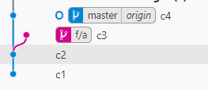
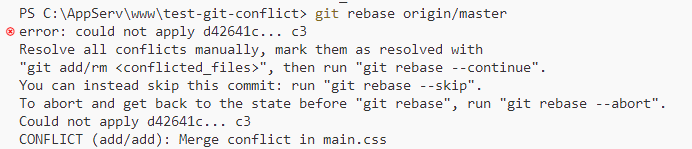
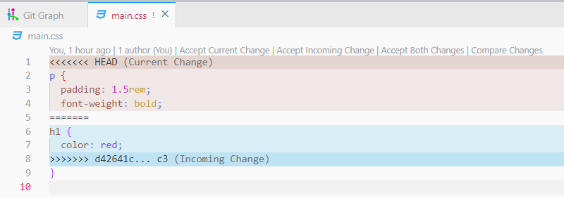
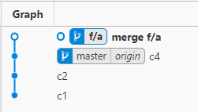
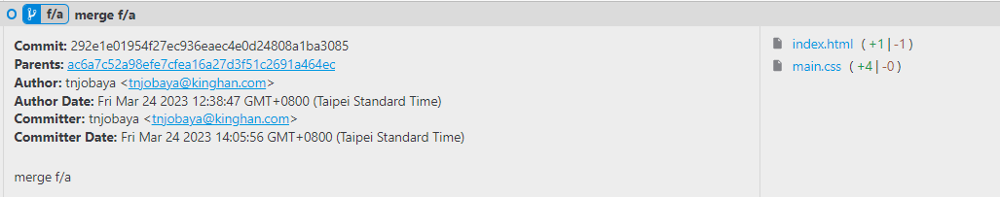
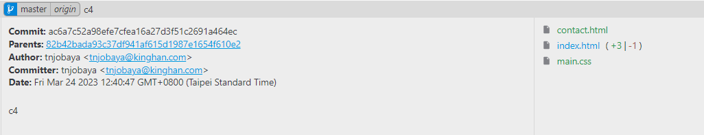
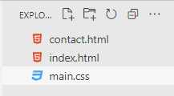

# 合併分支前已經出現新的提交怎麼辦

## 情境

- 假設目前的分支長這樣
    
    
    
    - 正在 f/a 開發功能，現在開發完要合併到 master
    - 可是已經有 C4 先被提交了，該如何**不會有衝突地提交**呢？

## 解決方法

1. Check out the feature branch:
    
    ```bash
    $ git checkout f/a
    ```
    
2. Fetch the latest changes from the main branch:
    
    ```bash
    $ git fetch origin
    ```
    
    - 合併前要先再 fetch 一次遠端，確認是不是已經獲得最新的 master branch commits
3. Rebase the feature branch onto the latest main branch:
    
    ```bash
    **$ git rebase master (或是 git rebase origin/master)**
    ```
    

## 解決衝突

1. 嘗試合併後會跳出以下訊息，表示有人跟你寫到同一份檔案了
    
    
    
2. Resolve any conflicts that may arise during the rebase process.
    - 訊息表示 main.css 有衝突，所以就去修正那個檔案…
3. 打開 main.css，有對方寫的 (下方) 跟自己寫的 (上方) 程式碼，把該留的部分留下來，剩下刪掉 
    
    
    
    - 如果不知道該留下哪幾段，通常都選 **Accept Both Changes**

## 合併衝突

1. Once the conflicts are resolved, commit the changes:
    
    ```bash
    $ git add .
    **$ git rebase --continue**
    ```
    
2. 解決完後的 graph 長這樣，注意目前 HEAD 還是留在 f/a 上，然後 C3 commit 不見了
    
    
    
    - C3 其實沒有不見，C3 沒有指頭指著它所以就不會顯示在畫面上，其實那次的提交紀錄還在
    - **C3 的「內容」已經跟 master 裡的提交合併，結合成 merge f/a 了**，程式碼並沒有丟失
    
    
    
    - 我在 C3 修改了這兩個檔案，合併後也就只顯示這兩個
    
    
    
    - C4 做了很多改動：新增了檔案、修改了 index.html

    

   - 我合併提交後，C4 的程式碼也載在我這裡了 (f/a 分支上)
   - 但我的提交紀錄依舊很乾淨，而且**現在 push 不會有衝突**